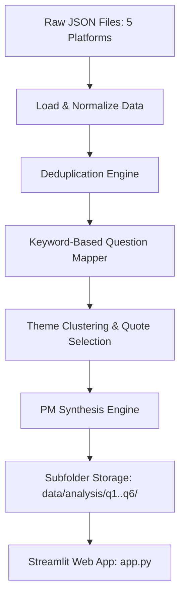

# Spotify Review Discovery Engine: System Architecture & Streamlit Deployment

This document details the system architecture, data flows, and Streamlit-based web dashboard implementation for the Spotify Review Discovery Engine. The system processes raw public user feedback from 5 sources, cleans and clusters the data, and presents structured PM insights through an interactive Streamlit application.

---

## 1. High-Level Pipeline Architecture

The system follows a modern data engineering pipeline, culminating in a Streamlit web application:



### Phase-by-Phase Details

1. **Load & Normalize Data**: Reads the 5 platform JSON files (App Store, Play Store, Reddit, Spotify Community forums, and Social Media) and maps them to a unified internal schema.
2. **Deduplication**: Identifies and removes exact and near-duplicate records using normalized string comparison to ensure metrics accuracy.
3. **Keyword-Based Question Mapper**: Searches the unified dataset for occurrences of specific keyword groupings corresponding to each of the 6 PM questions.
4. **Theme Clustering & Quote Selection**: Groups evidence by platform, clusters them into localized thematic groups, and extracts representative real quotes directly from the matching reviews.
5. **PM Synthesis Engine**: Formulates PM-style answers, conclusions, reasons why, and product implications, saving outputs inside individual subfolders (`data/analysis/q1/` to `data/analysis/q6/`) and as global reports.
6. **Streamlit Web Dashboard (`app.py`)**: Renders the insights interactively, showing real reviews, platform breakdowns, dynamic theme expansions, and overall conclusions.

---

## 2. Streamlit Web Dashboard Architecture

The frontend is implemented as a lightweight, reactive Python Streamlit application (`app.py`), designed around a dark-mode Spotify theme:

### App Components
1. **Sidebar Navigation**:
   - **Research Question Selector**: Quick toggle between the 6 PM questions.
   - **Data Volume Summary**: Real-time display of total processed records, deduplicated records, and platform counts.
   - **Quick Links**: Navigation to internal code repositories and documentation.
2. **Main Insights Panel**:
   - **PM Synthesis Block**: Display the PM-style Answer, "Why it is Happening", and Product Implication inside styled boxes.
   - **Metrics & Platform Breakdown**: Displays the breakdown of reviews across platforms (App Store, Play Store, Reddit, Spotify Community, Social Media) using Streamlit's native columns and bar charts.
   - **Key Themes & Representative Quotes**: For each theme under the selected question, it displays the count, summary, and an expandable list of the real user quotes.
3. **Interactive Review Explorer**:
   - Allows users to filter and browse the real matched reviews by source platform to see raw user feedback.
4. **Overall Strategic Conclusion**: A footer summarizing the strategic takeaway for the selected question and the overall engine results.

---

## 3. Running & Deployment Setup

### Local Run
To run the Streamlit app locally, run the following commands:
```bash
# 1. Install dependencies
pip install -r requirements.txt

# 2. Run the Streamlit server
streamlit run app.py
```

### Deployment Configuration
The project is configured for deployment on **Streamlit Community Cloud**:
- **Repository Source**: GitHub
- **Main File Path**: `app.py`
- **Dependencies**: Streamlit automatically detects and installs packages listed in `requirements.txt`.
